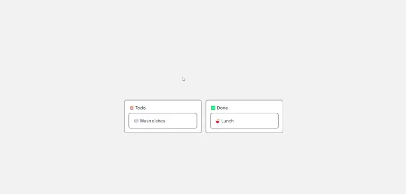

# Drag and Drop API
The Drag and Drop API is a lightweight and customizable library that enables developers to easily implement **drag-and-drop** functionality within web applications. It simplifies the process of making elements draggable and droppable, supporting a variety of use cases such as sortable lists, file uploads, and UI components management.

## Features:
- **Simple and Flexible API:** Easily integrate drag-and-drop with minimal configuration.
- **Customizable Behavior:** Define drag areas, drop targets, and handle events such as drag start, drag over, and drop.
- **Touch and Mouse Support:** Works seamlessly on both desktop and mobile devices.
- **Sortable Lists:** Reorder list items with intuitive drag-and-drop interactions.
- **File Upload:** Enable users to drag files from their desktop and drop them into your application.
- **Lightweight:** Minimal dependencies and optimized for performance.

## Setup:
Install Dependencies:
First, clone the repository and install the required dependencies.

```bash
npm install drag-and-drop-list
```

## Customize:
Modify the styles or the drag-and-drop logic to suit your needs. The data model can be updated dynamically with card and column information.

## How the Directives Work:
use
:
The dropzone directive is responsible for handling the drop events. It accepts a handler function, handleOnDropzoneEvent, which updates the card's columnId when dropped into a new column.

use
:
This directive enables the draggable behavior on each card. The card.id is passed as an argument, which is then used by the dropzone to identify the dragged card.

## How It Works:
- Each card belongs to a specific column, and you can move them between columns by dragging and dropping.
- The `dropzone` directive handles the drop events, and the `draggable` directive makes the cards draggable.

## Usage:

1. **Define the Markup**:  
   The structure uses an unordered list (`<ul>`) to create columns, and inside each column, there is another list for the draggable cards.

   ```javascript
   import { dropzone, draggable } from 'drag-and-drop-list';
   ```

   ```html
   <ul>
     { #each data.columnArray as column }
       { @const cardArray = data.cardArray.filter(card => card.columnId === column.id) }

       <li class="column" use:dropzone={
         {
           handleOnDropzoneEvent(
                cardId
                )
           {
             let card = data.cardArray.find( _card => _card.id === cardId );
             card.columnId = column.id;
             data = data;  // Update the data model
           }
         }
       }>
         <h2>{column.label}</h2>
         <ul class="card-list">
           { #each cardArray as card }
             <li use:draggable={ card.id }>{ card.title }</li>
           {/each}
         </ul>
       </li>
     {/each}
   </ul>
   ```

## Apply CSS Styles:
Below are the basic styles to give the columns and cards a clean, organized look. The **dropzone-droppable** class highlights the dropzone when a card is dragged over it, providing visual feedback.

```css
ul {
list-style: none;
padding: 0;
margin: 0;
display: flex;
gap: 1rem;
}

li {
padding: 1rem;
background-color: white;
border: 1px solid black;
border-radius: 0.5rem;
}

.column {
min-width: 25ch;
}

h2 {
margin-block-start: 0;
margin-block-end: 0.5rem;
}

.card-list {
flex-direction: column;
}

.column:global(.dropzone-droppable) {
outline: var(--outline-width) solid var(--outline-color);
outline-offset: var(--outline-offset);
}

.column:global(.dropzone-droppable) * {
pointer-events: none;
}
```

## Data Structure

   ```json
    let data =
        {
            columnArray:
            [
                {
                    id: 1,
                    label: '⏰ Todo'
                },
                {
                    id: 2,
                    label: '✅ Done'
                }
            ],
            cardArray:
            [
                {
                    columnId: 1,
                    id: '1',
                    title: '🍽️ Wash dishes'
                },
                {
                    columnId: 2,
                    id: '2',
                    title: '🍜 Lunch'
                }
            ]
        };
   ```

## Drag and Drop List Example



This project demonstrates a simple **drag-and-drop** interface where cards can be dragged between columns, using a customizable API. The example is built using **Svelte** and the **Drag and Drop API**.

## License:
This project is licensed under the MIT License.